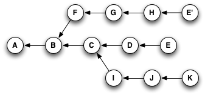

# Giting

This repository is to try advanced functionality of Git.


## Alias

You can setup a shortcut for a git command.

Alias are store in the `.gitconfig` file on `$HOME` dir.

You can set an alias in two way:

1. Using the following command: `git config --global alias.co checkout`;
2. Modifing the file below like this:

```
[alias]
  co = checkout
  ci = commit
  st = status
  br = branch
  graph = log --oneline --abbrev-commit --all --graph
  hist = log --pretty=format:\"%h %ad | %s%d [%an]\" --graph --date=short
  type = cat-file -t
  dump = cat-file -p
```

## Reset, Checkout and Revert

They all let you undo some kind of change in your repository, and the first two commands can be used to manipulate either commits or individual files.

In the first two command, you can pass a **file path** to determine their scope.

### Reset

On the **commit-level**, resetting is a way to move the tip of a branch to a different commit. This can be used to **remove commits** from the current branch.

Example:

    git checkout hotfix
    git reset HEAD^2

The two commits that were on the end of hotfix are now dangling commits, which means they will be deleted the next time Git performs a garbage collection

This usage of git reset is a **simple way to undo changes that haven’t been shared with anyone else**.

In addition to moving the current branch, you can also get git reset to alter the staged snapshot and/or the working directory by passing it one of the following flags:

- `--soft` – The staged snapshot and working directory are not altered in any way.
- `--mixed` – The staged snapshot is updated to match the specified commit, but the working directory is not affected. This is the default option.
- `--hard` – The staged snapshot and the working directory are both updated to match the specified commit.

### Checkout


### Revert


## Cherry Pick

It's take a commit from somewhere else, and "play it back" wherever you are right now. It creates a new commit with a new ID.

Situation before using `cherry-pick` command.


If you were at node H in this graph, and you typed `git cherry-pick E` you'd wind up with a copy of commit E.



It will add **only the changes** applied with the E commit and not in those before.

Example:

Given these sequence:

1. `git checkout -b develop`
2. `touch new-file-1.md`
3. `git add -A && git commit (ID 1233423)`
4. `touch new-file-2.md`
5. `git add -A && git commit (ID 5672839)`
6. `git co master`
7. `git cherry-pick 5672839`

We'll find the only the `new-file-2.md` in the current branch.


-----------------------

## References

- https://githowto.com/aliases
- http://think-like-a-git.net/sections/rebase-from-the-ground-up/cherry-picking-explained.html
- https://www.atlassian.com/git/tutorials/resetting-checking-out-and-reverting

